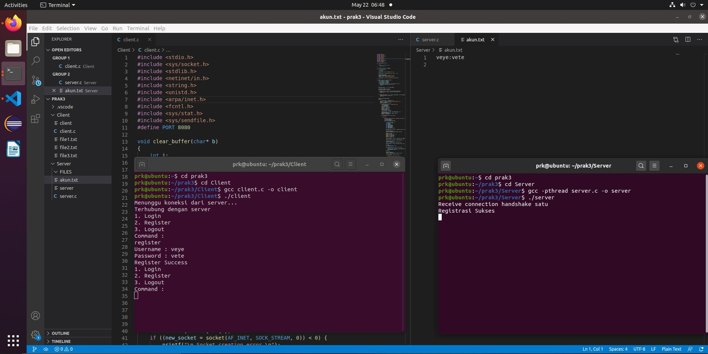
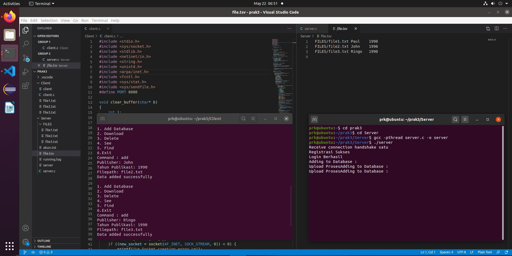
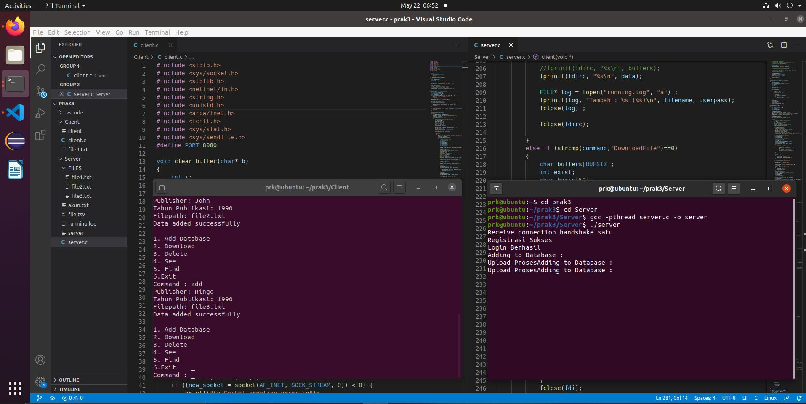
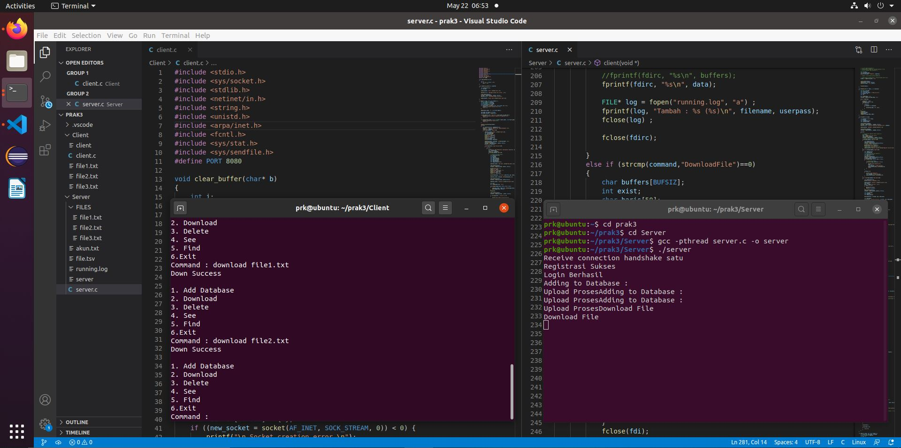
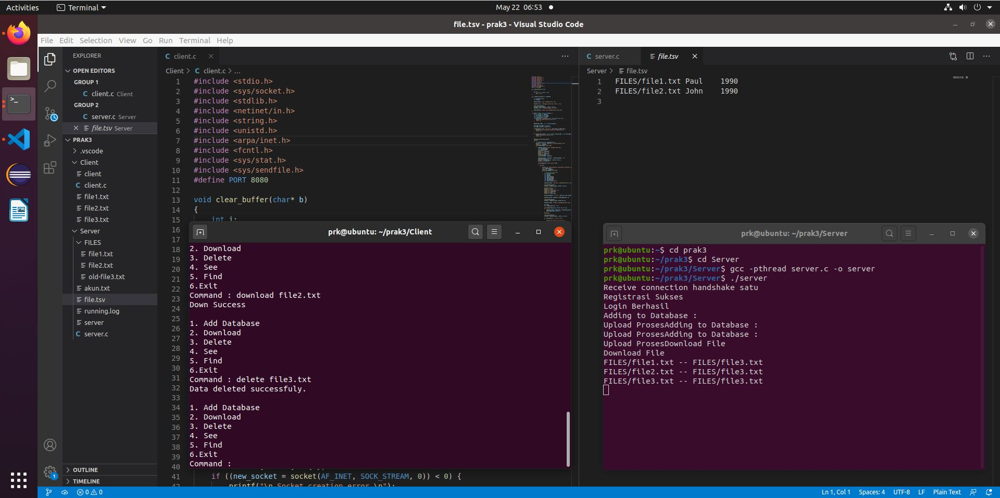
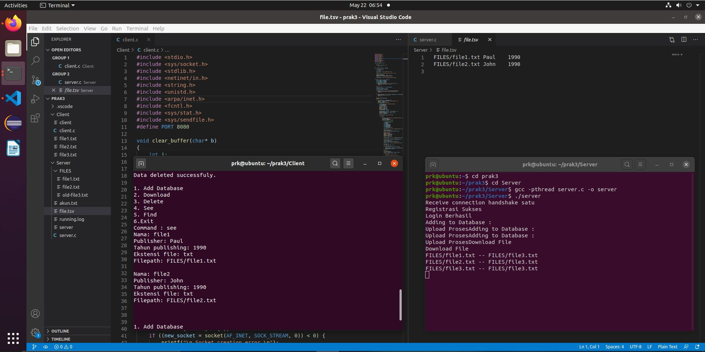
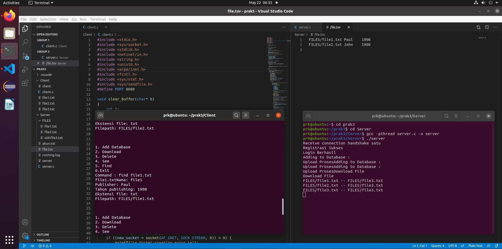
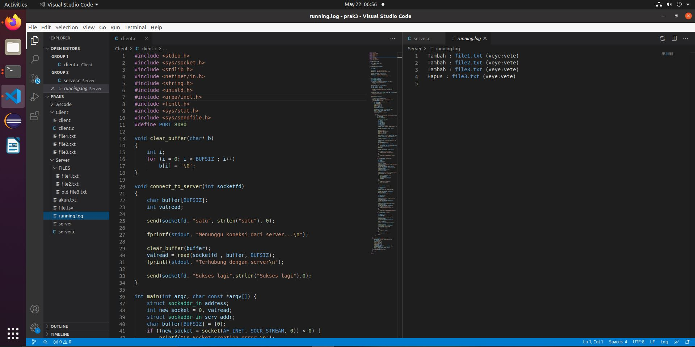

# soal-shift-sisop-modul-3-B09-2021


* Vincent Yonathan    - 05111940000186
* Aprilia Annisa      - 05111940000199
* Pramudityo Prabowo  - 05111940000210
---
### Soal Modul 3
[Soal Shift Modul 3](https://docs.google.com/document/d/1ud1JyncoSDAo5hA03wPvjn7QBHPUeUG1eBJ8ETtq2dQ/edit)

---

### Daftar isi
* [Soal 1](#soal-1)
* [Soal 2](#soal-2)
* [Soal 3](#soal-3)

---
### Soal 1
*Praktikan* diminta membantu mengerjakan suatu proyek dimana proyek tersebut meminta untuk membuat server database buku

#### 1.a)
*Praktikan* diminta untuk membuat register dan login yang sinkron antara Client dengan Server. Ketika memilih register, client akan diminta input id dan passwordnya untuk dikirimkan ke server.&nbsp; 
User juga dapat melakukan login. Login berhasil jika id dan password yang dikirim dari aplikasi client sesuai dengan list akun yang ada didalam aplikasi server. Sistem ini juga dapat menerima multi-connections. Koneksi terhitung ketika aplikasi client tersambung dengan server. Jika terdapat 2 koneksi atau lebih maka harus menunggu sampai client pertama keluar untuk bisa melakukan login dan mengakses aplikasinya. Data berisi akun dan password tersimpan dalam **akun.txt**.
#### Source Code
---
#### Client :
```c
...
    while(1)
    {
        char buffer[BUFSIZ], command[BUFSIZ];
        printf("1. Login\n2. Register\nCommand :\n");
        scanf("%s", command);
        if(strcmp(command,"login")==0)
        {
            send(new_socket,"login", strlen("login"),0);
            char username[200];
            char password[100];
            printf("Username : ");
            scanf("%s", username);
            printf("Password : ");
            scanf("%s", password);
            strcat(username, ":");
            strcat(username, password);

            send(new_socket , username , strlen(username) , 0 );
            clear_buffer(buffer);
            valread = read(new_socket , buffer, BUFSIZ);
            printf("%s\n",buffer);

            if(strcmp(buffer,"Login Success")==0)
            {
                while(1)
                {
                    printf("\n1. Add Database\n2. Download\n3. Delete\n4. See\n5. Find\n6. Logout\nCommand : ");
                    char command2[20];
                    scanf("%s", command2);
            ...
            ...
         else if(strcmp(command,"register")==0)
         {
            send(new_socket,"register", strlen("register"),0);
            char username[200];
            char password[100];
            printf("Username : ");
            scanf("%s", username);
            printf("Password : ");
            scanf("%s", password);
            strcat(username, ":");
            strcat(username, password);
            printf("%s\n",username);
            send(new_socket , username , strlen(username) , 0 );
            clear_buffer(buffer);
            valread = read(new_socket , buffer, BUFSIZ);
            printf("%s\n", buffer);
        }
```
#### Server :
```c
...
 while(1)
    {    
        // printf("Ini ngeprint while client\n");
        FILE *fdir;
        fdir = fopen("akun.txt","a+");    
        clear_buffer(command);
        valread = read(socketfd, command, BUFSIZ);
        // printf("%s-%ld",command,strlen(command));
        if(strcmp(command,"register")==0)
        { 
            char buffers[BUFSIZ];
            clear_buffer(buffers);
            valread = read(socketfd,buffers,BUFSIZ);
            // printf("%s\n", buffers);
            printf("Registrasi Sukses\n"); 
            fprintf(fdir,"%s\n",buffers);
            //pesan yang ditampilkan ke client
            send(socketfd,"Register Success",strlen("Register Success"),0);
        }
        else if (strcmp(command,"login")==0)
        {
            char temp[BUFSIZ];
            char userada[10];
            // printf("Ini kalo dia login\n");  
            char buffers[BUFSIZ];
            int flag = 0;
            clear_buffer(buffers);
            valread = read(socketfd,buffers,BUFSIZ);
            while(fgets(temp, BUFSIZ, fdir) != NULL) 
            {
                // printf("%s",temp);
                if((strstr(temp, buffers)) != NULL) 
                {
                    printf("Login Berhasil\n");
                    flag = 1;
                    char kata[20] = "Login Success";
                    send(socketfd,kata, strlen(kata),0);
                    break;
                }                
            }
            // printf("bisa ga print");
            if(flag == 0)
            {
                printf("Login Gagal\n");
                char kata[20] = "Login Failed";
                send(socketfd,kata, strlen(kata),0);
            }
        }
     ...
```

#### Thread pada Server 
```c
...
    while(1)
    {
        if ((new_socket = accept(server_fd, (struct sockaddr *)&address, (socklen_t*)&addrlen))<0) 
        {
            perror("accept");
            exit(EXIT_FAILURE);
        }

        pthread_create(&(tid[total]), NULL, &client, &new_socket);
        pthread_join(tid[total],NULL);
        total++;   
    }
  ...
```
Untuk kedua fungsi ini. Server akan diinisialisasi dengan membuka akun.txt
```c
FILE *fdir;
fdir = fopen("akun.txt","a+"); 
```
##### Explanation
##### Register
- Fungsi Register pertama akan mengirim dengan `send` yang akan diterima oleh server via `read` yang berisi "register" agar server dapat mengetahui perintah apa yang sedang diminta oleh user.
- Kemudian, server akan membaca `buffer` yang berisi register tersebut dan mengirimkan `send` kepada client bahwa perintah diterima.
- Server juga akan melakukan perintah ``
- Client kemudian akan meminta input dari user berupa username dan password. 
- Dengan format yang diminta soal yaitu (username:password) maka akan dilakukan strlen agar sesuai.
- Kemudian format data yang telah dibuat Client di `send` kepada Server
- Ketika diterima di server, server akan langsung menjalankan perintah untuk menulis data (username:password) ke **akun.txt** menggunakan `fprintf(fdir,"%s\n",buffers);`
- Terakhir Server akan melakukan `send` kepada Client untuk memberitahu bahwa registrasi telah berhasil dimana berparameter "Register Success" yang kemudian akan di `read` oleh Client dan ditampilkan ke user.
---
##### Login 
- Fungsi Login pertama tentu akan mengirim dengan `send` yang akan diterima oleh server via `read` yang berisi "login" agar server mengetahui apa yang harus dilakukan.
- Ketika sudah menerima perintah dari client, server juga akan memberikan `send` kepada client bahwa `command` telah sukses diterima.
- Client kemudian akan memproses input yang diterima dari user dimana input tersebut merupakan `username` dan `password`.
- Karena input tersebut akan dibandingkan dengan user yang ada pada **akun.txt** (dimana formatnya adalah username:password). Maka akan dilakukan strcat untuk membuat format yang sama.
- Kemudian akan dilakukan iterasi sebanyak line yang ada pada **akun.txt** dan akan dibandingkan satu persatu. Antara filename yang dicari dengan yang ada.
- Apabila ada baris yang mengandung isi data yang sama dengan yang dicari, maka program Server akan melakukan `send` dimana "Login Success" merupakan parameternya agar dapat di print di Client.
- Setelah menemukan data yang sama dengan yang dicari, kemudian program akan di `break` agar keluar dari looping dan tidak membuang banyak waktu.
- Apabila data yang dicari tidak ditemukan hasil yang sama pada **akun.txt** maka program akan melakukan `send` dengan parameter "Login Failed" untuk memberi tahu bahwa ada kesalahan yang dilakukan oleh user.
- Apabila login berhasil, program Client kemudian akan menampilkan menu utama dimana menu tersebut menerima input `command` untuk melakukan : Add Data, Download Data, Delete Data, See, Find, dan Logout.
Dimana berarti user hanya akan dapat melakukan kegiatan ini ketika sudah berhasil login.
- Karena diminta aga server dapat menghandle banyak connections. Maka dibuat thread untuk menghandle setiap koneksi. 
- Untuk itu, Digunakan fungsi pthread_join untuk menunggu thread sampai selesai baru membuat thread baru lagi untuk membuat koneksi dengan client baru.

#### Output :


---
#### 1.b)
*Praktikan* diminta untuk membuat sistem database yang bernama files.tsv. Isi dari files.tsv ini adalah path file saat berada di server, publisher, dan tahun publikasi. Setiap penambahan dan penghapusan file pada folder file yang bernama  FILES pada server akan memengaruhi isi dari files.tsv.

#### Source Code
---
#### Client :
```c
// Akan bergabung dengan fitur "Add".
```

#### Server :
```c
 ...
        FILE *fdirc;
        fdirc = fopen("file.tsv", "a+");
        if (fdirc == NULL) 
            {
              perror("No File");
              exit(EXIT_FAILURE);
            }
    ...
````
##### Explanation :
- Nomor 1 b. diminta untuk membuat database bernama file.tsv yang berada di server.
- Kemudian juga diminta untuk berisi path, publisher dan tahun publikasi.
- Untuk nomor 1 b ini, cukup membuat di server mendeklarasikan `FILE *fdirc` yang bertugas untuk membuka atau `fdirc = fopen("file.tsv","a+")`.
- Kemudian apabila tidak ada maka akan mengeluarkan "No File".

---

#### 1. c)
*Praktikan* diminta untuk membuat fitur `Add` dimana client dapat menambah file baru ke dalam server dalam FILES dengan struktur (`namafile.exstensi`). Kemudian, dari aplikasi client akan dimasukan data buku tersebut (perlu diingat bahwa Filepath ini merupakan path file yang akan dikirim ke server). Ketika file diterima di server, maka row dari files.tsv akan bertambah sesuai dengan data terbaru yang ditambahkan.

#### Source Code
---
#### Client :
```c
  if(strcmp(command2,"add")==0)
        {
            // printf("Ini masuk add");
            char buffer[BUFSIZ];
            int valread;
            char pub[20];
            char tahun_pub[10];
            char path_file[50];
            char add_data[110];
            char len_data[20];
            char temp_files[BUFSIZ];

            send(new_socket, "New Data", strlen("New Data"), 0);

            clear_buffer(buffer);
            valread = read(new_socket, buffer, BUFSIZ);

            printf("Publisher: ");
            scanf("%s", pub);
            printf("Tahun Publikasi: ");
            scanf("%s", tahun_pub);
            printf("Filepath: ");
            scanf("%s", path_file);

            sprintf(add_data, "%s:%s:%s", path_file, pub, tahun_pub);

            send(new_socket, add_data, strlen(add_data), 0);

            clear_buffer(buffer);
            valread = read(new_socket, buffer,BUFSIZ);
            printf("ini buffer sebelum terakhir --> %s\n",buffer);

            send(new_socket, "berhasil",strlen("berhasil"),0);

            FILE *fd;
            fd = fopen(path_file, "rb");

            while(fgets(temp_files, BUFSIZ, fd) != NULL) 
            {
                send(new_socket, temp_files, strlen(temp_files), 0);
                bzero(temp_files, BUFSIZ) ;
            }
            fclose(fd) ; 

            clear_buffer(buffer);
            valread = read(new_socket , buffer, BUFSIZ);

            if (strcmp(buffer, "success") == 0) 
            {
                printf("Data added successfully\n");
            } 
            else 
            {
                printf("There's a problem adding data\n");
            }
```
#### Server :
```c
  else if(strcmp(command,"New Data")==0)
        {
            char buffers[BUFSIZ];
            printf("Adding to Database :\n");

            send(socketfd, "success", strlen("success"), 0);
            FILE *fdirc;
            fdirc = fopen("file.tsv", "a+");
            if (fdirc == NULL) 
            {
                perror("No File");
                exit(EXIT_FAILURE);
            }
            clear_buffer(buffers);
            valread = read(socketfd, buffers, BUFSIZ);

            char filename[50];
            char pub[50];
            char tahun_pub[10];            

            ekstrak(buffers, filename, pub, tahun_pub);

            char data[200];
            sprintf(data, "FILES/%s\t%s\t%s", filename, pub, tahun_pub);

            upload(socketfd,filename);

            printf("buffer co --> %s\n",buffers);
            send(socketfd, "success", strlen("success"), 0);

            //fprintf(fdirc, "%s\n", buffers);
            fprintf(fdirc, "%s\n", data);

            FILE* log = fopen("running.log", "a") ;
            fprintf(log, "Tambah : %s (%s)\n", filename, userpass);
            fclose(log) ;
            
            fclose(fdirc);

        }
```
#### Explanation :
- Pertama, user harus melakukan login terlebih dahulu untuk dapat mengakses fitur "Add" ini. Command untuk mengaktifkan command ini adalah "add".
- Ketika user mengetik "add" maka Client akan `send` ke server dan memberitahu bahwa perintah pada server yang diminta adalah "New Data", yang dimana telah disiapkan pada Server yaitu membaca buffer yang dikirim Client dan melakukan `strcmp`.
- Setelah itu, Server akan menjalankan perintah membuka dan menulis di `file.tsv` dengan perintah seperti pada nomor 1.b) yaitu dengan `fopen()`.
- Kemudian Client akan meminta input berupa publisher, tahun publikasi, dan file path dari data yang akan ditambahkan, dan akan segera dilakukan format sesuai yang diminta oleh soal dengan `sprintf(add_data, "%s:%s:%s", path_file, pub, tahun_pub);`.
- Kemudian Client akan send variable `add_data` yang menyimpan data yang telah diformat, dan akan diterima oleh Server. Kemudian Server akan melakukan ekstrak yaitu ekstraksi data apa saja yang ada dan disimpan ke variable .
- Pada Client, maka akan dilakukan looping untuk memberi data sepanjang line yang berada pada file yang ditambahkan oleh user.
- Selanjutnya, Server akan menerima tiap data menulis pada folder FILES dengan file yang ada dengan `sprintf(data, "FILES/%s\t%s\t%s", filename, pub, tahun_pub);`.
- Kemudian, Server akan melakukan `upload()` yaitu menunggah file ke folder FILES.
- Kemudian akan ditambahkan ke file.tsv dengan cara `fprintf(fdirc, "%s\n", data);`.
- Dan terakhir, Server akan `send` kode "Success" untuk membiarkan Client mengetahui bahwa menambah data baru telah berhasil atau gagal.

---
#### Output :


---
#### 1. d)
*Praktikan* diminta untuk membuat fitur `Download File` dimana client dapat mendownload file yang telah ada dalam folder FILES di server dengan prosedur Server harus melihat dari files.tsv untuk melakukan pengecekan apakah file tersebut valid. Jika tidak valid, maka mengirimkan pesan error balik ke client. Jika berhasil, file akan dikirim dan akan diterima ke client di folder client tersebut.

#### Source Code
---
#### Client :
```c
 else if(strcmp(command2, "download")==0)
        {
            char buffer[BUFSIZ];
            int valread;
            char filename[50];
            char local[100];

            scanf("%s", filename);
            send(new_socket,"DownloadFile", strlen("DownloadFile"),0);

            clear_buffer(buffer);
            valread = read(new_socket, buffer, BUFSIZ);
            printf("buffer client --> %s\n", buffer);

            send(new_socket, filename, strlen(filename),0);
            clear_buffer(buffer);
            read(new_socket,buffer,BUFSIZ);
            printf("Apakah ini down success? --> %s\n",buffer);

            strcpy(local,filename);

            send(new_socket,"ds diterima", strlen("ds diterima"),0);

            if(strcmp(buffer,"Down Success")==0) 
            {
                printf("%s\n",buffer);
                FILE* file = fopen(local, "w");
                clear_buffer(buffer);
                read(new_socket,buffer,BUFSIZ);
                fprintf(file, "%s", buffer);
                fclose(file);
            }
            else
            {
                printf("File not found.\n");
                printf("%s\n",buffer);
            }


        }

```
#### Server :
```c
 else if (strcmp(command,"DownloadFile")==0)
        {
            char buffers[BUFSIZ];
            int exist;
            char baris[50];
            char iterationb[30];
            //untuk saat found
            char datat[BUFSIZ];
            printf("Download File\n");

            send(socketfd, "Success Download", strlen("Success Download"),0);

            clear_buffer(buffers);
            valread = read(socketfd, buffers, BUFSIZ);
            printf("buffer server --> %s\n", buffers);
            
            char file_path[100] = "FILES/";
            strcat(file_path,buffers);

            FILE *fdi;
            fdi = fopen("file.tsv","r");
            while (fgets(baris, sizeof(baris), fdi)) 
            {
                int index = 0;
                pisah(baris, iterationb, '\t', &index);
                printf("%s -- %s\n", iterationb, file_path);
                if (strcmp(iterationb, file_path) == 0)
                {
                    exist = 1;
                    break;
                }
            }
            fclose(fdi);
            if (exist)
            {
                send(socketfd, "Down Success", strlen("Down Success"),0 );
                // printf("buffer ketemu --> %s\n",buffers);
                // printf("Ada ni filenya\n");
                clear_buffer(buffers);
                read(socketfd,buffers,BUFSIZ);
                fdi = fopen(file_path,"rb");
                while(fgets(datat, BUFSIZ, fdi) != NULL) 
                {
                    send(socketfd, datat, strlen(datat), 0);
                    bzero(datat,BUFSIZ);
                }
                fclose(fdi);
                bzero(buffers,BUFSIZ);
            }
            else
            {
                send(socketfd, "Down Failed", strlen("Down Failed"),0);
            } 
        }
```
#### Explanation :
- Untuk melakukakan download, user harus melakukan login dan memberi command untuk mengaktifkan command ini yaitu "download".
- Ketika user mengetik "download" maka Client akan `send` ke server dan memberitahu bahwa perintah pada server yang diminta adalah "DownloadFile", yang dimana telah disiapkan pada Server yaitu membaca buffer yang dikirim Client dan melakukan `strcmp`.
- Kemudian client akan meminta input berupa nama file dan melakukan `send` ke Server yang nantinya diterima oleh server sebagai nama file yang akan didownload.
- Karena file yang akan dicari akan dicari pada direktori `FILES/` yang disimpan dan harus dilakukan `strcat(file_path,buffers);`. 
- Kemudian Server akan membuka file.tsv dan akan melakukan looping `while` untuk membandingkan direktori yang ingin didownload dengan isi tiap line dari `file.tsv`, apabila nama file cocok dengan salah satu dari line di file.tsv, maka akan langsung dilakukan break dan variable exist akan diubah menjadi 1.
- Ketika file yang dicari ada, maka Server akan mengirim ke client "Download Success", kemudian akan melakukan proses open file_path yang diinginkan read binary dengan parameter "rb" untuk melakukan send data perbaris di filepath tersebut.
- Client akan melakukan `fopen()` untuk membuka file dengan nama yang sama seperti yang akan di download dan menerima data per line daripada file yang akan didownload dan menulisnya di file baru. Apabila gagal akan diprint "Download Failed" dan "File Not Found".

---
#### Output :


---
#### 1. e)
*Praktikan* diminta untuk membuat fitur `Delete` dimana client dapat menghapus file yang tersimpan di server. Namun tidak dihapus, hanya diganti nama menjadi ‘old-NamaFile.ekstensi’. Kemudian ketika file telah diubah namanya, maka row dari file tersebut di file.tsv akan terhapus.

#### Source Code
---
#### Client :
```c
 else if (strcmp(command2,"delete")==0)
            {
                char buffer[BUFSIZ];
                int valread;
                char namafile[50];

                send(new_socket,"Delete", strlen("Delete"),0);

                clear_buffer(buffer);
                valread = read(new_socket,buffer,BUFSIZ);

                scanf("%s",namafile);

                send(new_socket,namafile,strlen(namafile),0);

                clear_buffer(buffer);
                valread = read(new_socket,buffer,BUFSIZ);
                if (strcmp(buffer,"Success")==0)
                {
                    printf("Data deleted successfuly.\n");
                }
                else
                {
                    printf("There's a problem deleting data\n");
                }
            }
```
#### Server :
```c
else if(strcmp(command,"Delete")==0)
        {
            char temp[] = "file.tsv";
            char namatemp[] = "FILES/";
            char buffers[BUFSIZ];
            int valread;
            char iterasi[30];
            char baris[50];
            char namafile[50];
            int exist;
            int line;

            send(socketfd,"Success",strlen("Success"),0);

            //untuk nerima nama file
            clear_buffer(buffers);
            valread = read(socketfd,buffers,BUFSIZ);

            strcpy(namafile,buffers);
            strcat(namatemp,namafile);

            FILE *fdel;
            fdel = fopen("file.tsv","r");
            while (fgets(baris, sizeof(baris), fdel)) 
            {
                line++;
                int index = 0;
                pisah(baris, iterasi, '\t', &index);
                printf("%s -- %s\n", iterasi, namatemp);
                if (strcmp(iterasi, namatemp) == 0)
                {
                    exist = 1;
                    break;
                }
            }
            fclose(fdel);
            if(exist)
            {
                char path_file[100];
                sprintf(path_file,"FILES/%s",namafile);

                char new_name[100];
                sprintf(new_name,"FILES/old-%s",namafile);

                delete_tsv(temp,line);

                rename(path_file, new_name);

                send(socketfd,"Success", strlen("Success"),0);

                FILE* dlog = fopen("running.log", "a") ;
                fprintf(dlog, "Hapus : %s (%s)\n", namafile, userpass);
                fclose(dlog);
            }
            else
            {
                send(socketfd,"Failed", strlen("Failed"),0);
            }

```
#### Explanation :
- Untuk melakukan delete, user harus mengetikkan command "delete" diikuti dengan namafile.exstensi
- Client akan mengirimkan perintah "Delete" kepada Server yang dimana telah disiapkan pada Server yaitu membaca buffer yang dikirim Client dan melakukan `strcmp`.
- Kemudian Server akan melakukan iterasi untuk mencari file mana yang akan di delete dalam file.tsv dengan cara yang sama seperti iterasi pada download dan juga akan disimpan line yang memiliki data yang sama seperti pada nama yang akan di delete.
- Bedanya adalah ketika ditemukan, nama file akan disimpan kedalam suatu variable dan juga nama yang baru yaitu "old-Namafile.extensi" juga akan disimpan dalam variable.
- Setelah itu, akan dipanggil fungsi delete_tsv dimana dideklarasikan 2 tsv yaitu lama dan baru, yang lama menyimpan seluruh file yang di "add" oleh user, setelah itu akan dicopy smeua line kecuali line yang dimana file yang akan didelete itu ditemukan pada looping tadi
- Terakhir, nama file akan diganti dari yang tadinya "Namafile.extensi" menjadi "old-Namafile.extensi".
- Apabila gagal, maka akan dikirimkan bahwa "Failed".
---
#### Output :


---
#### 1. f)
*Praktikan* diminta untuk membuat fitur `See` dimana client dapat melihat semua isi files.tsv. Output dari perintah tersebut keluar dengan format yang tertera pada soal.

#### Source Code
---
#### Client :
```c
...
 else if(strcmp(command2,"see")==0)
    {
	char buffer[BUFSIZ];
	int valread;

	send(new_socket, "See", strlen("See"), 0);

	clear_buffer(buffer);
	valread = read(new_socket,buffer,BUFSIZ);
	printf("%s\n",buffer);
    }
...
```
#### Server :
```c
 else if (strcmp(command,"See")==0)
        {
            int valread;
            char buffers[BUFSIZ];
            char files[300];
            char data[BUFSIZ];
            char datafix[BUFSIZ];

            FILE *fi;
            fi = fopen("file.tsv","r");

            clear_buffer(datafix);
            while (fgets(files, sizeof files, fi)) 
            {
                printf("Masuk While\n");
                int idx = 0;
                char publ[50];
                char nama[20];
                char file_ext[10];
                char tahun_pub[10];
                char file_path[100];
                char header_path[50];

                pisah(files, header_path, '/', &idx);
                pisah(files, nama, '.', &idx);
                pisah(files, file_ext, '\t', &idx);

                // printf("Ini header_path %s\n", header_path);
                // printf("Ini file_ext %s\n", file_ext);
                // printf("Ini nama %s\n", nama);
                sprintf(file_path, "%s/%s.%s", header_path, nama, file_ext);
                
                pisah(files, publ, '\t', &idx);
                pisah(files, tahun_pub, '\n', &idx);
                // printf("Ini publ %s\n", publ);
                // printf("Ini tahun_pub %s\n", tahun_pub);
                sprintf(data, "Nama: %s\nPublisher: %s\nTahun publishing: %s\nEkstensi file: %s\nFilepath: %s\n\n", nama, publ, tahun_pub, file_ext, file_path);

                //printf(data, "Nama: %s\nPublisher: %s\nTahun publishing: %s\nEkstensi file: %s\nFilepath: %s\n\n", nama, publ, tahun_pub, file_ext, file_path);
                strcat(datafix, data);   
                printf("strcat buffer di while %s\n",data);     
            }
            printf("strcat buffer data %s\n",datafix);  
            send(socketfd,datafix,strlen(datafix),0);
            fclose(fi);
        }
```
#### Explanation :
- Untuk melakukan See, user harus mengetikkan command "see" dan sudah login.
- Client akan mengirimkan perintah "see" kepada Server yang dimana telah disiapkan pada Server yaitu membaca buffer yang dikirim Client dan melakukan `strcmp`.
- Kemudian Server akan membuka file.tsv dan mengiterasi satu persatu barisnya.
- Iterasi tersebut sekaligus memanggil fungsi yang akan memisahkan data (publisher, tahun publish, dll) dan menyimpannya dalam variable.
- Kemudian, server akan menggunakan `sprintf(data, "Nama: %s\nPublisher: %s\nTahun publishing: %s\nEkstensi file: %s\nFilepath: %s\n\n", nama, publ, tahun_pub, file_ext, file_path);` untuk melakukan print data yang telah di pisah dan ekstrak.
- Karena ide saya adalah hanya `send` 1x, maka Server melakukan `strcat` untuk data yang akan dikirm sehingga nantinya data yang akan dikirim berisi semua data yang telah difilter.
- Lalu terakhir, server akan melakukan `send` data final tersebut dan akan diterima oleh Client untuk ditampilkan.
---
#### Output :


---
#### 1. g)
*Praktikan* diminta untuk membuat fitur `Find` dimana clientdapat melakukan pencarian dengan memberikan suatu string. Hasilnya adalah semua nama file yang mengandung string tersebut.

#### Source Code
---
#### Client :
```c
else if(strcmp(command2,"find")==0)
	    {
		char buffer[BUFSIZ];
		int valread;
		char findfile[50];

		send(new_socket,"Find", strlen("Find"),0);

		clear_buffer(buffer);
		valread = read(new_socket,buffer,BUFSIZ);
		clear_buffer(buffer);

		scanf("%s",findfile);

		send(new_socket,findfile,strlen(findfile),0);

		clear_buffer(buffer);
		valread = read(new_socket,buffer,BUFSIZ);
		// printf("Buffer find --> %s\n",buffer);
		if(strcmp(buffer,"Failed") == 0)
		{
		    printf("%s\n",buffer);
		}
		else
		{
		    printf("%s\n",buffer);
		}
	    }
```
#### Server :
```c
else if (strcmp(command,"Find")==0)
        {
            char buffers[BUFSIZ];
            int valread;
            char files[300];
            char data[BUFSIZ];
            char fordata[BUFSIZ];
            int flag = 0;

            send(socketfd,"Success",strlen("Success"),0);

            clear_buffer(buffers);
            valread = read(socketfd,buffers,BUFSIZ);

            char filename[50];
            strcpy(filename,buffers);

            FILE* ffile;
            ffile = fopen("file.tsv","r");

            while (fgets(files, sizeof files, ffile)!= NULL) 
            {
                char file_exist[50];
                char delim = '\t';
                int idxs = 0;
                pisah(files, file_exist, delim, &idxs);
                if (strstr(file_exist, filename))
                {   
                    int idx = 0;
                    char publ[50];
                    char nama[20];
                    char file_ext[10];
                    char tahun_pub[10];
                    char file_path[100];
                    char header_path[50];

                    flag = 1;

                    pisah(files, header_path, '/', &idx);
                    pisah(files, nama, '.', &idx);
                    pisah(files, file_ext, '\t', &idx);

                    // printf("Ini header_path %s\n", header_path);
                    // printf("Ini file_ext %s\n", file_ext);
                    // printf("Ini nama %s\n", nama);
                    sprintf(file_path, "%s/%s.%s", header_path, nama, file_ext);
                    
                    pisah(files, publ, '\t', &idx);
                    pisah(files, tahun_pub, '\n', &idx);
                    // printf("Ini publ %s\n", publ);
                    // printf("Ini tahun_pub %s\n", tahun_pub);
                    sprintf(fordata, "Nama: %s\nPublisher: %s\nTahun publishing: %s\nEkstensi file: %s\nFilepath: %s\n\n", nama, publ, tahun_pub, file_ext, file_path);\

                    strcat(buffers, fordata);
                    //printf("Ini FIND =----\nIni buffers dan fordata --> %s\n", buffers);
                }
            }
            if(flag == 1)
            {
                send(socketfd, buffers, strlen(buffers),0 );
            }
            else
            {
                send(socketfd,"Failed", strlen("Failed"),0);
            }
            
            fclose(ffile);
        }
        
```
#### Explanation :
- Untuk melakukan Find, user harus mengetikkan command "find" diikuti dengan namafile.exstensi
- Client akan mengirimkan perintah "Delete" kepada Server yang dimana telah disiapkan pada Server yaitu membaca buffer yang dikirim Client dan melakukan `strcmp`.
- Kemudian, server akan melakukan `strcpy` filename kedalam variable untuk menyimpan filename tersebut.
- Setelahnya, server membuka file.tsv dan mengiterasi satu-persatu baris yang ada pada file.tsv tersebut.
- Langkah berikutnya sama seperti pada "See" yaitu memanggil fungsi yang akan memisahkan data (publisher, tahun publish, dll) dan menyimpannya dalam variable.
- Kemudian, server akan menggunakan `sprintf(data, "Nama: %s\nPublisher: %s\nTahun publishing: %s\nEkstensi file: %s\nFilepath: %s\n\n", nama, publ, tahun_pub, file_ext, file_path);` untuk melakukan print data yang telah di pisah dan ekstrak.
- Dan juga melakukan strcat untuk ide send yang hanya sekali.
- Terakhir, pada looping diatas. Apabila file yang ingin dicari (find) ditemukan, terdapat variable flag yang berubah menjadi 1 menandakan bahwa file yang dicari ada. Paling akhir, apabila file tersebut ada maka akan dikirimkan socketfd berisi buffers yaitu data yang telah diproses.
- Apabila file tidak ada, akan dikirim socketfd berisi buffer yang berisikan "Failed".
---
#### Output :


---
#### 1. h)
*Praktikan* diminta untuk membuat suatu log untuk server yang bernama **running.log** dengan format seperti pada soal.
#### Source Code
---
#### Server :
---
#### Add Data
```c
...
    FILE* log = fopen("running.log", "a") ;
    fprintf(log, "Tambah : %s (%s)\n", filename, userpass);
    fclose(log) ;

    fclose(fdirc);
```
#### Delete Data :
```c
...
    FILE* dlog = fopen("running.log", "a") ;
    fprintf(dlog, "Hapus : %s (%s)\n", namafile, userpass);
    fclose(dlog);
```
#### Explanation :
- Untuk membuat log, soal meminta log berada pada Server sehingga sebelum melakukan login, tentunya Server akan menerima data username:password dari client untuk dicek pada akun.txt
- Kemudian data buffer itu akan disimpan dalam satu variable misalkan `userpass`
- Disini, membuat log hanya dengan mendeklarasikan `FILE* log = fopen("running.log", "a") ;`.
- Kemudian ketika file sudah ddibuka, maka akan melakukan `fprintf` sesuai format soal yaitu Tambah untuk `add` dan Hapus untuk `delete`.
- `fprintf(log, "Tambah : %s (%s)\n", filename, userpass);` atau `fprintf(dlog, "Hapus : %s (%s)\n", namafile, userpass);`.
- Dan akhirnya, tidak boleh lupa bahwa file harus ditutup dengan `fclose()`.

#### Output


---
#### Kendala :
- Read dan Send yang terkadang sulit untuk di track dan debug. 
- Kesulitan karena seringkali terjadi deadlock atau keadaan saling menunggu.
- Soal terlalu banyak, waktu terlalu singkat.
- Terkadang terjadi bug pada program.

---
#### Output :


---
---
### Soal 3
*Praktikan* mampu membuat sebuah program c untuk mengkategorikan file-file yang jumlahnya banyak. Dimana program ini akan memindahkan file sesuai dengan eksistensinya dan hasilnya akan disimpan kedalam *Working Directory* ketika program tersebut dijalankan.

### Terdapat beberapa *Function* :
- **Membuat *Direktori***

#### Source Code :
```c
...
	void bikinDirektori(char *direktorinya) {
		struct stat fileaku = {0};

		if (stat(direktorinya, &fileaku) == -1) {
			mkdir(direktorinya, 0777);
		}
	}
...
```
#### Penjelasan :
Pada fungsi ini menginisialisasi `struct`dengan nama *fileaku*. Lalu jika fungsi ini dipanggil maka akan membuat sebuah direktori yang baru.

- **Mendapatkan *Eksistensi***

#### Source Code :
```c
...
	char dapetinExt(char *namaFile, char *extension) {
    		char *temp = strchr(namaFile, '.');
   		if(!temp) {strcpy(extension,"Unknown");}
    		else if(temp[1] == '.'){strcpy(extension,"Hidden"); }
		else{strcpy(extension,temp+1);}
	}
...
```

#### Penjelasan :
Pada fungsi `dapetinExt` maka program akan membaca dari nama file dari `.` sampai akhir. Dimana jika nama file tidak ada eksistensinya maka akan dicopy kedalam variabel *extension* sehingga membuat folder dengan nama "Unknown". Jika pada file diawali dengan `.Hidden` maka akan dicopy kedalam variabel *extension* sehingga membuat folder dengan nama "Hidden".

- **Check File**

#### Source Code :
```c
...
	int checkFile(char *basePath){
		struct stat buffer;
    		int exist = stat(basePath,&buffer);
    		if(exist == 0){
       			 if(S_ISREG(buffer.st_mode)) 
           			return 1;
        		 else 
	   			return 0;
    		}
    		else{
			return 0;
		}     
	}
...
```

#### Penjelasan :
Pada fungsi `checkFile` maka program akan mengecek jika didalam direktori itu adalah file reg makan akan mengembalikan nilai true, tetapi jika selain dari file reg maka akan mengembalikan nilai false. Tetapi jika filenya tidak ada maka akan mengembalikan nilai false.

- **Memindahkan File**

#### Source Code :
```c
...
void *pindahinajadeh(void *arg)
{
    char basePath[PATH_MAX];
    strcpy(basePath,(char *) arg);

    if(checkFile(basePath))
    {
        char *i,*b;
        char fullPath[PATH_MAX];
        strcpy(fullPath,(char *) arg);

        char namaFile[100];

        for(i=strtok_r(fullPath,"/",&b); i!=NULL; i=strtok_r(NULL,"/",&b)) 
		{
            memset(namaFile,0,sizeof(namaFile));
            strcpy(namaFile,i);
        }

        char extension[PATH_MAX];
        dapetinExt(namaFile, extension);

        if(strcmp(extension,"Hidden") != 0 && strcmp(extension,"Unknown") != 0)
        {
            for(int i = 0; i<strlen(extension); i++)
            {
                if(extension[i]>64 && extension[i]<91){
					extension[i]+=32;
				}
            }
        }
        char cwd[PATH_MAX];
        if (getcwd(cwd, sizeof(cwd)) == NULL)
		{
            perror("getcwd() error");
            return (void *) 0;
        }

       
        char destDir[PATH_MAX];
        sprintf(destDir,"%s/%s",cwd,extension);
        
        bikinDirektori(destDir);

        char destination[PATH_MAX];
        sprintf(destination,"%s/%s/%s",cwd,extension,namaFile);
       
        rename(basePath,destination);
        
        return (void *) 1;
    }

    else return (void *) 0;
}
...
```

#### Penjelasan :
Pada fungsi `pindahinajadeh` adalah fungsi yang berguna untuk memindahkan Filenya sesuai dengan eksistensinya, dimana dalam fungsi ini akan memanggil juga fungsi untuk `dapetinExt` untuk pengecekan. Lalu pada fungsi ini juga mengecek setiap huruf kapital akan diubah menjadi huruf kecil, dan akan memanggil fungsi pembuaan direktori untuk membuat direktori yang baru.

- **Fungsi Rekursif**

#### Source Code :
```
...
void fungsinyagaes(char *argv){
	int it=-1; struct dirent *direk;
   	DIR *direktorinya = opendir(argv);
	
	while ((direk = readdir(direktorinya)) != NULL) {
		char pathnya[300];
		
		if (strcmp(direk->d_name, ".") != 0 && strcmp(direk->d_name, "..") != 0) {
			if(direk->d_type == DT_REG) {
				
				strcpy(pathnya,"");strcat(pathnya, argv);strcat(pathnya, "/");strcat(pathnya, direk->d_name);
				pthread_create(&tid[++it], NULL, pindahinajadeh, (void *) pathnya);
				pthread_join(tid[it], NULL);
			}
			else if(direk->d_type == DT_DIR) {
				struct dirent *direk1;
   				DIR *direktorinya1 = opendir(argv);
				char pathnya0[300];
				strcpy(pathnya0,"");strcat(pathnya0, argv);strcat(pathnya0, "/");strcat(pathnya0, direk->d_name);
				fungsinyagaes(pathnya0);
   				closedir(direktorinya1);
			}
		}
	}
	closedir(direktorinya);
}
...
```

#### Penjelasan :
Pada fungsi `fungsinyagaes` merupakan sebuah fungsi untuk membuka dan membaca direktori pada setiap inputan, serta pada fungsi ini akan memanggil fungsi dari `pindahinajadeh` yang akan membuat thread baru juga. Terdapat 2 pengecekan, jika pada pengecekan tersebut adalah sebuah direktori maka akan memanggil ulang fungsi `fungsinyagaes` untuk mengakses isi dari dalam direktori tersebut berupa file-file yang ada.

#### Soal 3.a)
*Praktikan* mampu membuat program sehingga dapat menerima opsi `-f`, sehingga pengguna dapat menambahkan argumen file yang bisa dikategorikan sebanyak yang diinginkan oleh pengguna.
- Jika output berhasil dikategorikan maka akan mengeluarkan output : **File 1 : Berhasil Dikategorikan**
- Jika output tidak berhasil dikategorikan maka akan mengeluarkan output : **File 2 : Sad, gagal**

#### Source Code :
```c
...
    if(strcmp(argv[1],"-f")==0) 
    {
	int i=0;
		for(int j=2;j<argc;j++)
		{
		    pthread_create(&(tid[i]), NULL, pindahinajadeh, (void*) argv[j]);
		    i++;
		}
		for (int j=0;j<(i);j++)
		{
		    long dicek;
		    void *st;
		    pthread_join( tid[j], &st);
		    dicek = (long) st;
			// printf("%ld", dicek);
		    if(dicek == 1) 
			printf("File %d : Berhasil Dikategorikan\n", j+1);
		    else 
			printf("File %d : Sad, gagal :(\n", j+1);
		}
        
        return 0;
    }
...
```

#### Penjelasan :
Pada fungsi opsi `-f` ini akan membuat thread dari opsi yang diinginkan oleh User, dimana pada pembuatan thread akan memanggil fungsi `pindahinajadeh` dan akan dilakukan pengecekan. Jika pada fungsi ini direktori berhasil dibuat maka akan menghasilkan output yang berisikan *"Berhasil dikategorikan"* tetapi jika tidak, maka akkan menghasilkan output yang berisikan *"Sad, gagal :("*.

#### Soal 3.b)
*Praktikan* mampu membuat program sehingga dapat menerima opsi `-d`, dimana user hanya dapat menginputkan satu direktori saja. Hasil dari pengkategorian akan disimpan kedalam *Current Working Directory* dimana program tersebut dijalankan.
- Jika program berhasil dikategorikan maka akan mengeluarkan output : **Direktori sukses disimpan!**
- Jika program gagal dikategorikan maka akan mengeluarkan output : **Yah, gagal disimpan :(**

#### Source Code :
```c
...
	else if(strcmp(argv[1], "-d") == 0){
			if( ENOENT != errno ) {
				fungsinyagaes(argv[2]);
				printf("Direktori sukses disimpan!\n");
			}
			else {
				printf("Yah, gagal disimpan :(\n");
			}
	}
...
```

#### Penjelasan :
Pada fungsi opsi `-d`, jika berhasil dikategorikan akan memanggil *function* `fungsinyagaes` dimana pada fungsi tersebut akan mengecek setiap isi dari direktori yang akan di akses dan akan memindahkan direktori yang telag dikategorikan ke dalam cwd. Sehungga jika pada program berhasil membuat direktorinya dan memindahkan pengkategorian direktori kedalam cwd maka akan mengeluarkan output *"Direktori sukses disimpan!"*. Tetapi jika program tidak berhasil dalam membuat direktori dan memindahkan pengkategorian direktori kedalam cwd maka akan mengeluarkan output *"Yah, gagal disimpan :("*.

#### Soal 3.c)
*Praktikan* mampu membuat program sehingga dapat menerima opsi `*`, dimana program akan mengkategorikan seluruh file yang ada di *Current Working Directory* ketika menjalankan program tersebut.

#### Source Code :
```c
...
	else if (strcmp(argv[1], "*") == 0) {
		char cwd[300];
		getcwd(cwd, sizeof(cwd));
		fungsinyagaes(cwd);
	}
...
```

#### Penjelasan :
Pada fungsi opsi `*` akan mengalokasikan memori untuk variabel dari cwd, dimana setelah itu akan memanggil fungsi `fungsinyagaes` yang akan mengkategorikan semua file yang di **cwd** sesuai dengan eksistensinya.

#### Kendala :
- Bingung ketika pada program `-d` pengkategorian tidak pindah ke cwd
- Bingung ketika terdapat lebih dari satu eksistensi, tetapi hanya satu saja yang dapat dikategorikan
